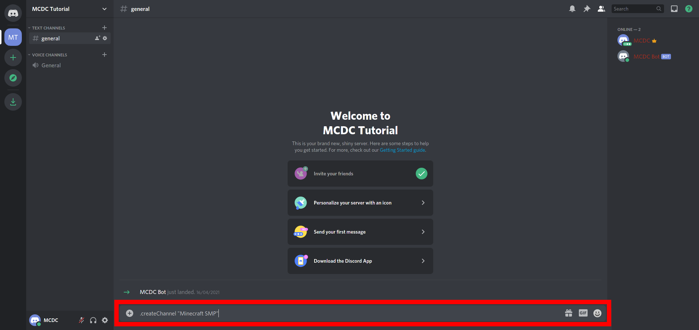
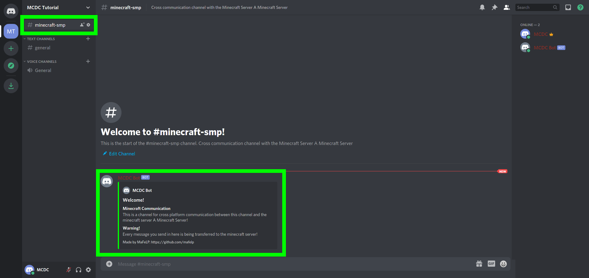
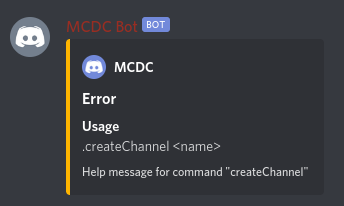

# [Discord]: Create Channel command
## What does it do?
This command creates a new Channel, to which minecraft messages are being sent and from which the messages are sent to the minecraft chat.

---

## How to use it?
Command: `prefix`+`createChannel` (not case sensitive)  
Arguments:
- the name of the channel to create **(in quotes, if you use spaces in your name!)**

---

## Which permissions are required?
### For the user
See configuration:  
permission.discordServerAdmin.allowedUserIDs    
The users [ID](./../get-channel-id#user-id) must be present in this configuratin list entry. Or use `config add permission.discordServerAdmin.allowedUserIDs THE_ID` to add the users ID to the trusted IDs.

### For the bot
The bot must have the permission to create and manage channels. For the best, the bot would have Administrator priviledges.

---

## Example
Example: `.createChannel "Minecraft SMP"`    
Send the command to a channel, the bot can read and write.  
  
You'll get this reply and a new channel was creatd.  
  
In the newly created channel, the bot will have sent this message:  
  

---

## On wrong usage

