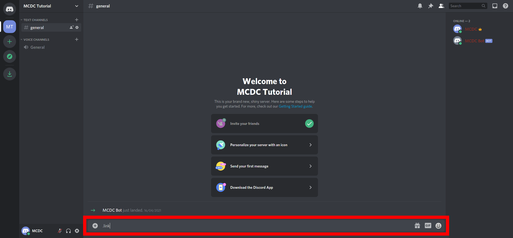
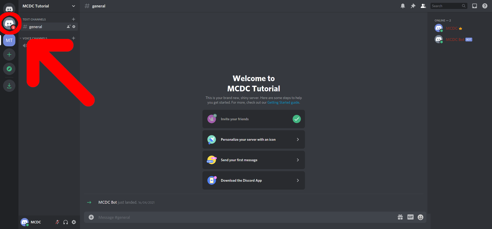
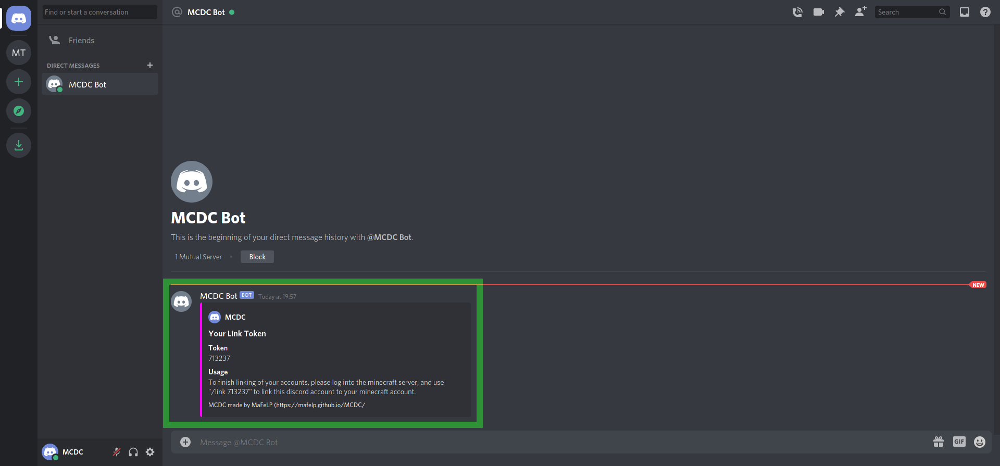
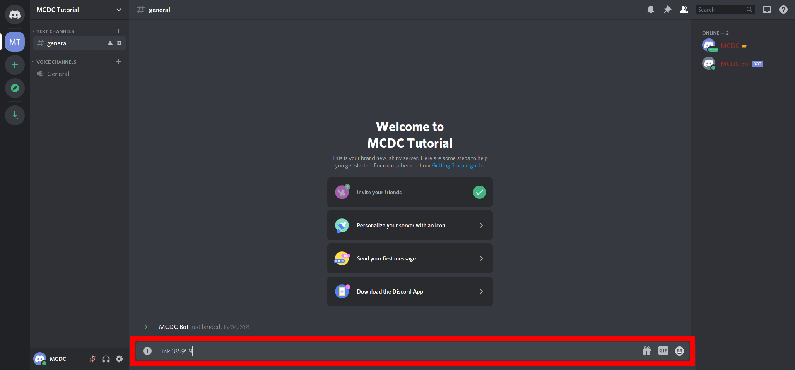
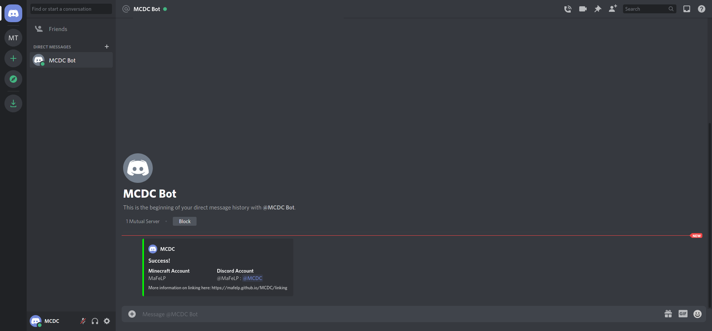

# [Minecraft/Discord]: Link command
## What does it do?
- This command lets you create an unofficial account for this server, so you can get mentioned by the bot on the discord server.
- You will also be able to use the minecraft command [/whisper](./whisper) to send a private message to a player/user with an account.

## How to use it:
### Generate a link token (Step 1):
#### On discord:
Command: `prefix`+`link` <br>
Arguments: none
#### In Minecraft (as a player):
Command: `/link`<br>
Arguments: none

### Use a link token (Step 2):
#### On discord:
Command: `prefix`+`link ` <br>
Arguments:
 - The token you generated in "Step 1 - generate a link token"
#### In minecraft:
Command: `/link ` <br>
Arguments:
- The token you generated in "Step 1 - generate a link token"

---

## Which permissions are required?
There are no special permissions required, but the server admin can decide to disable linking in the [configuration](./../configuration) by changing the section `enableLinking` to false or executing the command `config set enableLinking false` in the server's console.

---

## Example:
### Step 1:
#### On discord:
Send the command `.link` to a discord channel or to the bot via private message: <br>
 <br>
You should have received a new direct message from the bot. <br>
 <br>
This message contains the linking token and basic instructions for step two. <br>
 <br>
#### In minecraft:
Just execute the following command:
```
/link
```

Example response:
```
[MCDC]: You link token is: 185959. Use the command ".link 185959" to link this minecraft account ot your discord account.
```

### Step 2:
#### On discord:
Send the command `.link <YOUR LINK TOKEN>` to a discord channel or to the bot via private message. Replace `<YOUR LINK TOKEN>` with the link token you just acquired in Step 1 with the minecraft command:<br>
<br>
You should have received a new direct message from the bot. <br>
 <br>
In this message, there should be a confirmation, that your accounts have been linked successfully.<br>
<br>
#### In minecraft:
Execute the following command and replace `<YOUR LINK TOKEN>` with the token you just acquired in Step 1 on discord.
```
/link <YOUR LINK TOKEN>
```

Example response:
```
[MCDC]: Successfully linked this player account to the discord user @MaFeLP
```