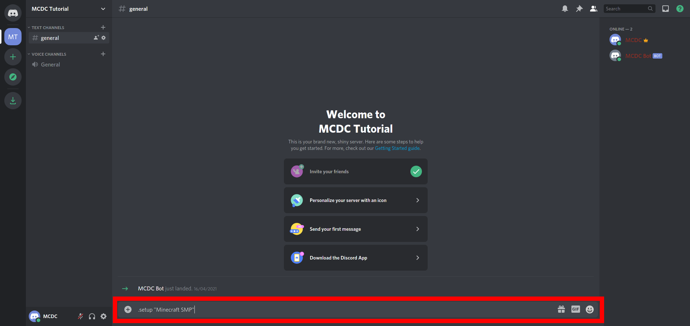
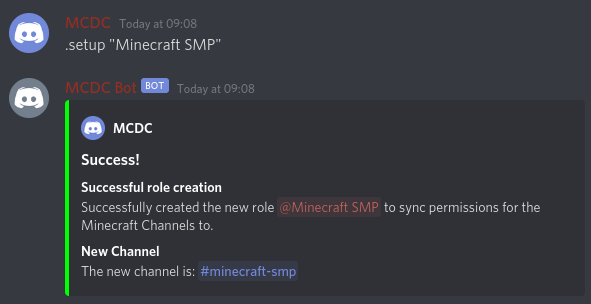
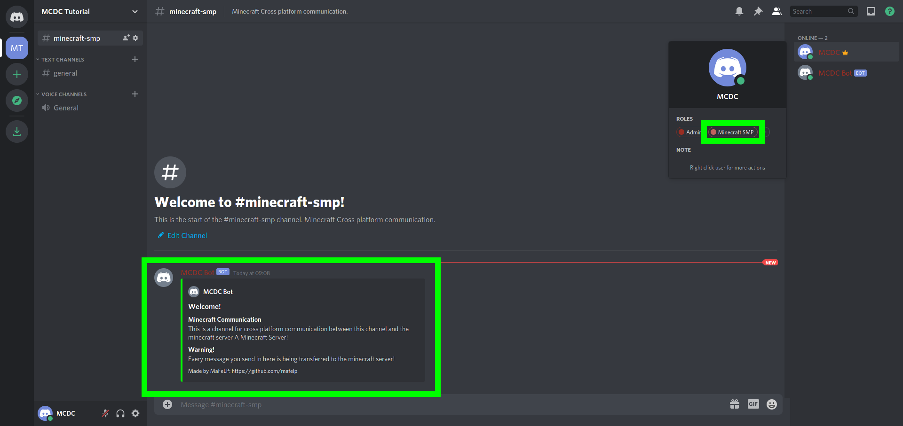
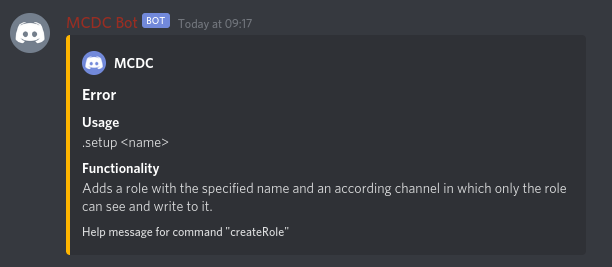

# [Discord]: Setup command
## What does it do?
Creates a new Channel and a new role. To this channel are message from the minecraft chat being broadcasted. Also messages sent to this channel are being setn to the minecraft chat and al players.

---

## How to use it?
Command: `prefix`+`setup` (not case sensitive)  
Arguments:
- the name of the channel / role to create **(in quotes, if you use spaces in your name!)**

---

## Which permissions are required?
### For the user
See configuration:  
permission.discordServerAdmin.allowedUserIDs    
The users [ID](./../get-channel-id#user-id) must be present in this configuratin list entry. Or use `config add permission.discordServerAdmin.allowedUserIDs THE_ID` to add the users ID to the trusted IDs.

### For the bot
The bot must have the permission to create and manage channels. For the best, the bot would have Administrator priviledges.

---

## Example
Example: `.setup "Minecraft SMP"`    
Send the command to a channel, the bot can read and write.  
  
Your get this reply and get a new role, which can be set to the channel, for users who have the role to access it. This feature is currently not implementable due to regulations in this bot's API.  
  
In the newly created channel, the bot will have sent this message:  
  

---

## On wrong usage

