# Creating an admin role
## Requirements
You need to have the permission to manage the server or to manage server roles, so you can grant the bot the 
required permissions.

## Steps on how to create the role
1. On the main page, select the server you want to add the role to and then click on the Server name in the top left corner.  
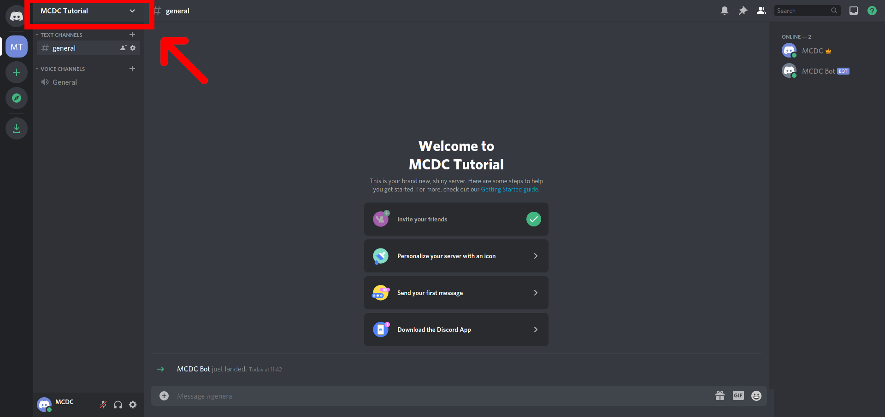  
2. In the context menu, select `Server Settings`.  
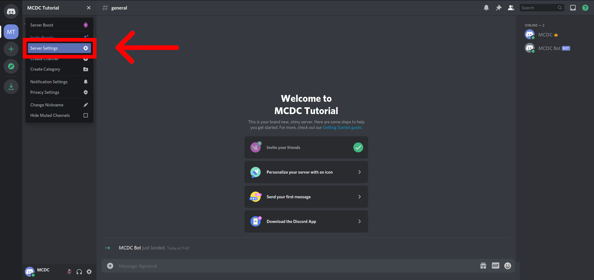  
3. In the left side bar, select the roles tab.  
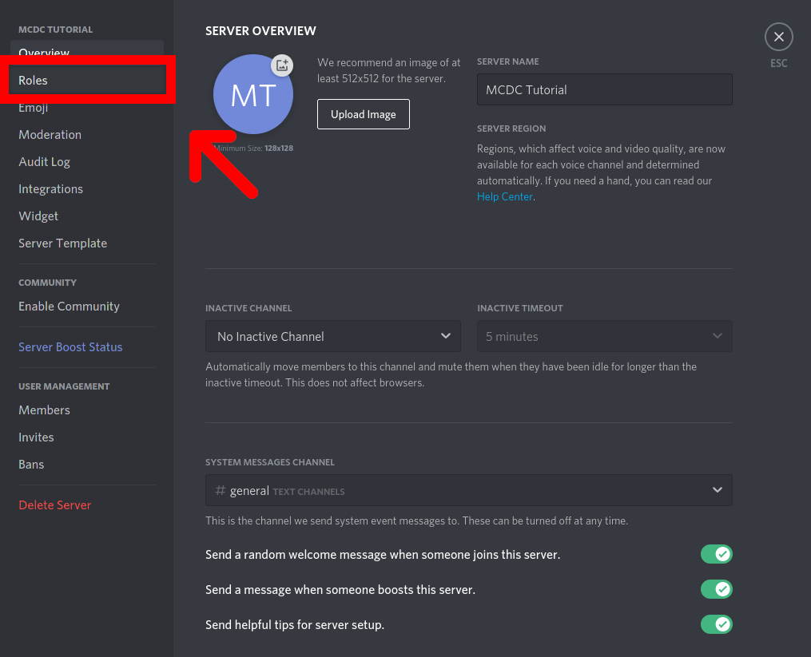  
4. Create a new Role by clicking on the small Plus sign. It says `Create Role`, when you hover over it.  
  
5. Give the role a name, for example `Admin`.  
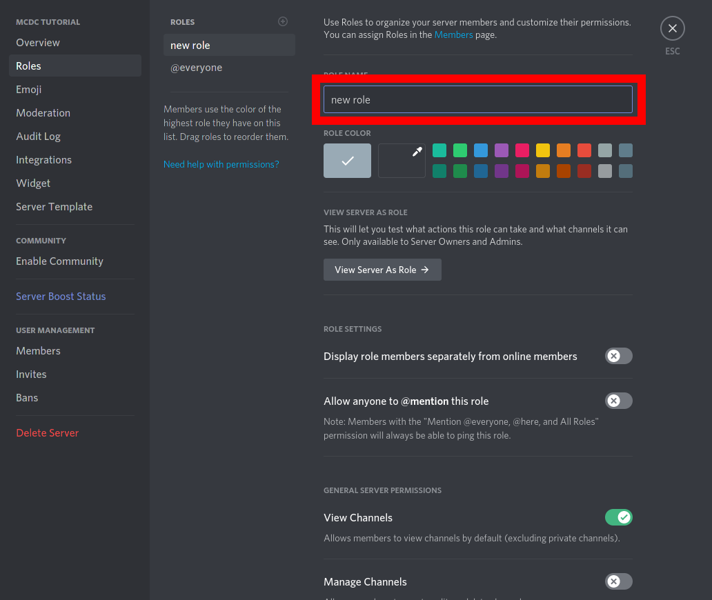  
6. Select a color, by clicking on one of the colored tiles or create a "custom one" by clicking the blank tile and then selecting the color.  
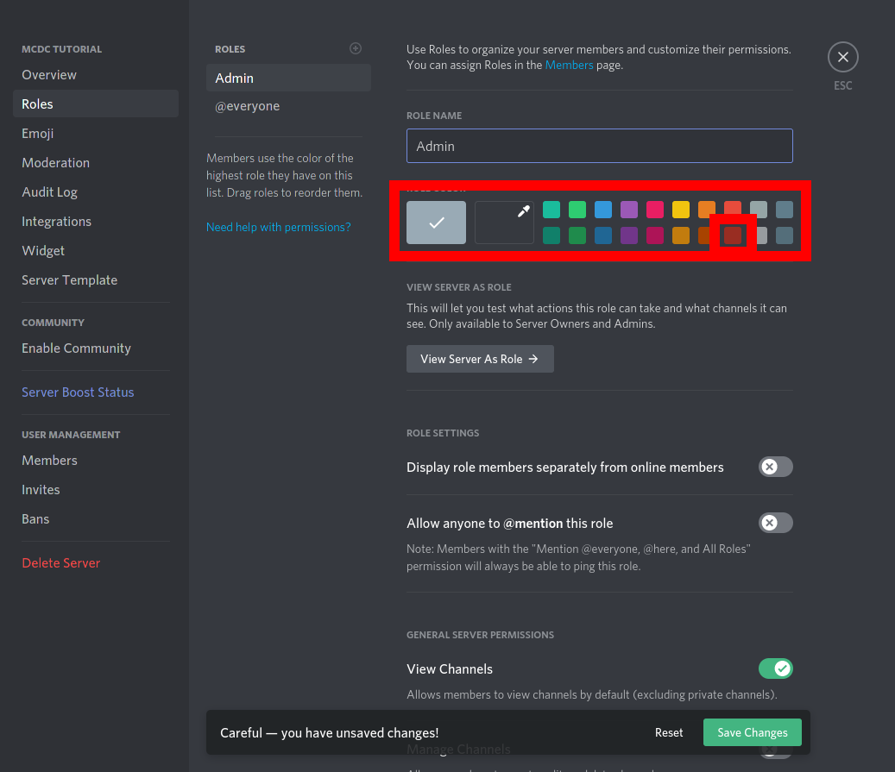  
7. Scroll down until you reach the bottom.  
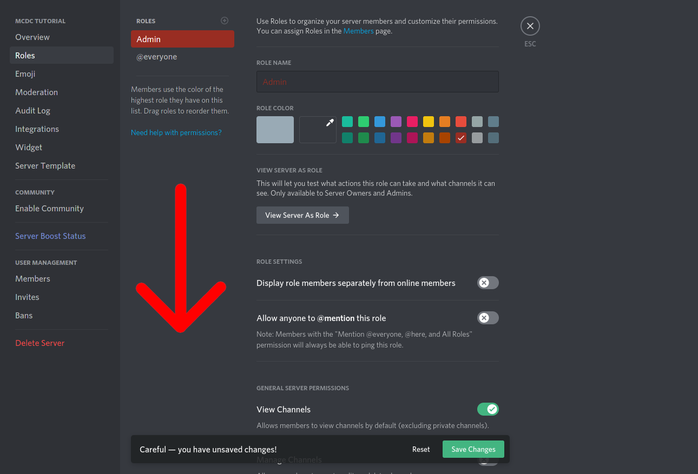  
8. On the far bottom, click the slider in the section `Administrator` until it is green.  
  
9. Save your changes, by clicking on the green button on the bottom, called `Save Changes`.  
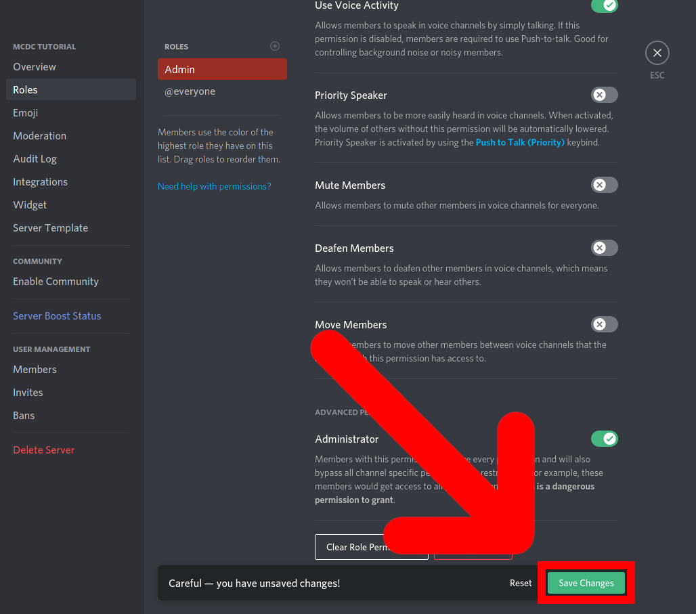  
10. Exit the Settings menu, by hitting the escape key on your keyboard or clicking the `X` in the top right corner.  
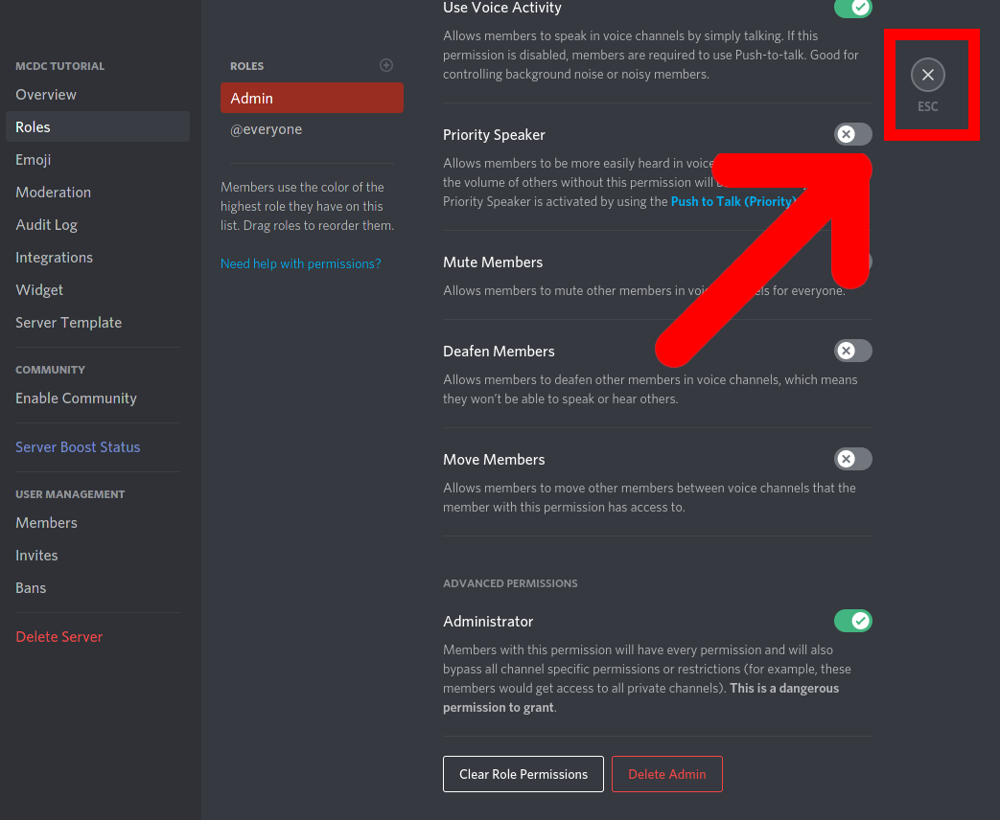  
11. Open the context menu of a user, by clicking with the left mouse button on the user you want to give the role to. In this case, the Bot.  
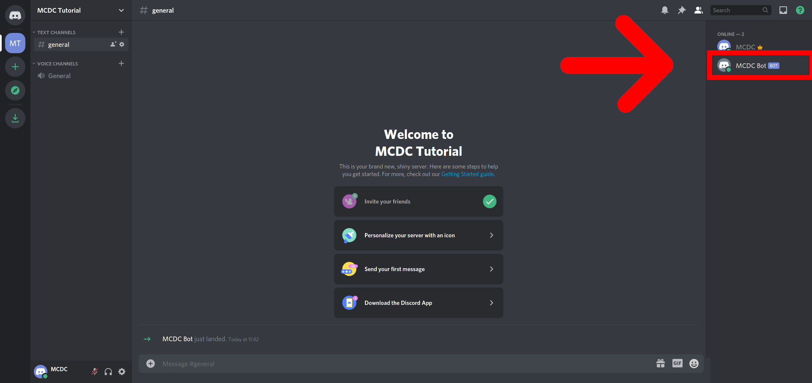  
12. Add the newly created Role to the user by clicking on the small plus button.  
  
13. In the list, select the newly created role, by clicking on it.  
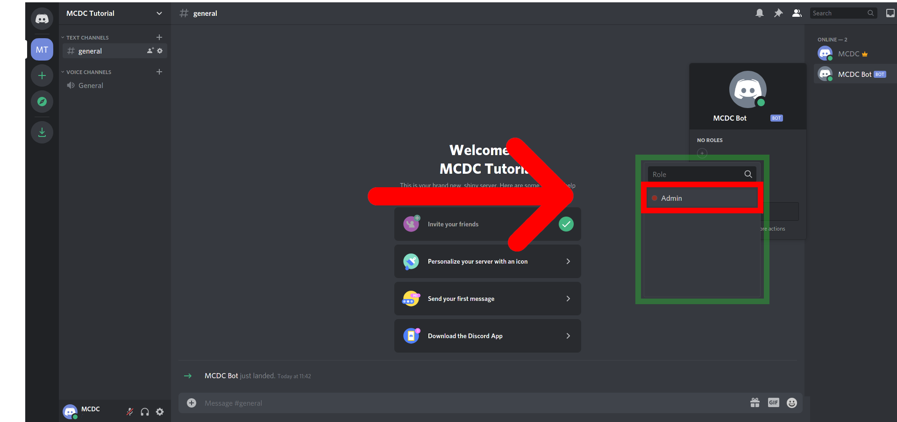  
14. Your now Role should now appear in the list of the roles of the user.  
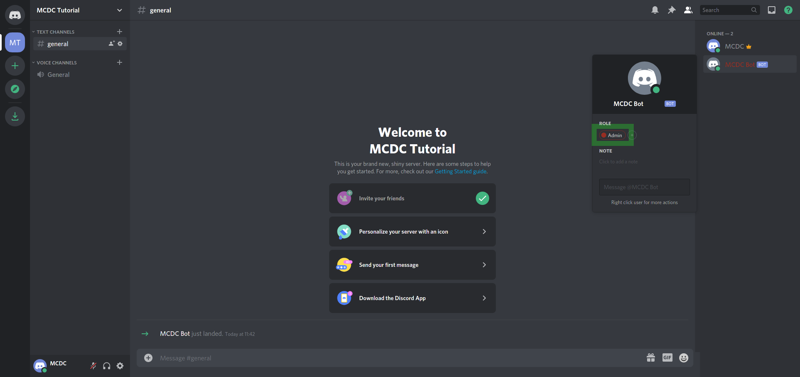
