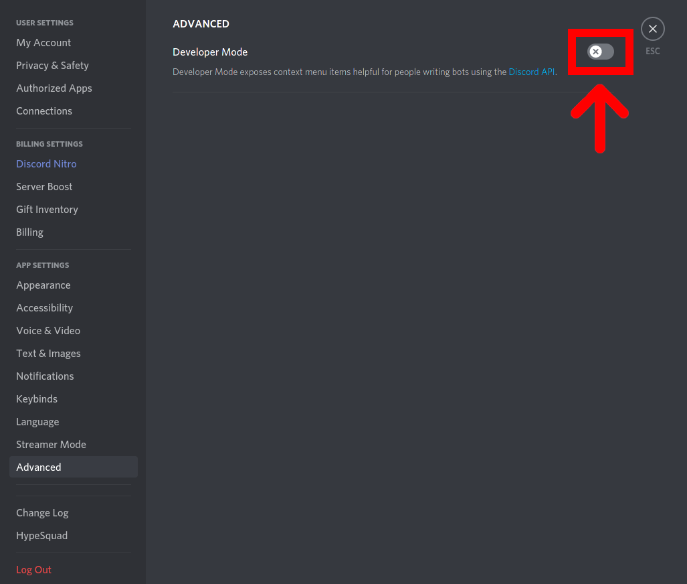
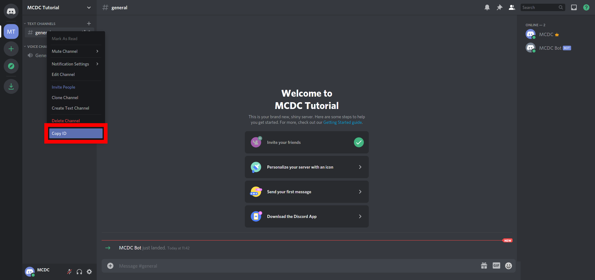

# Get IDs of Users/Channels
## Enable Discord Developer Mode
1. In your discord App, in the bottom left corner, click on the `User settings` wheel.

2. In the left Side bar, now lcik on `Advanced`.

3. In the top right corner, now enable the developer mode, by clicking the slider, until it is green.

4. Now close the User Settings, by hitting the `Escape Key` or clicking on the `X` in the top right corner.


## Get the Channel ID
1. Right click on the channel you want to get the ID of.

2. Click the `Copy ID button`.


The ID is copied to your clipboard and you can add this channel to the channels, to which the plugin braodcasts minecraft messages, by executing the command
```
/config add channelIDs <Ctrl + Shift + V to paste the ID>
```

as a player or 

```
config add channelIDs <Ctrl + Shift + V to paste the ID>
```

in the console.
