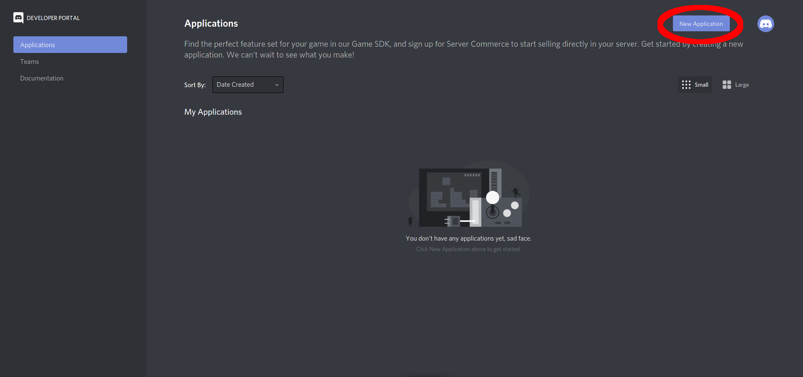
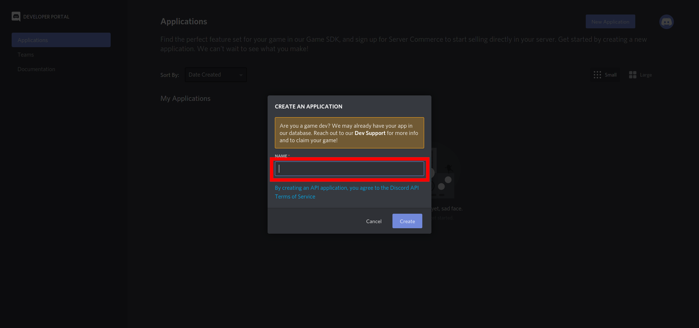
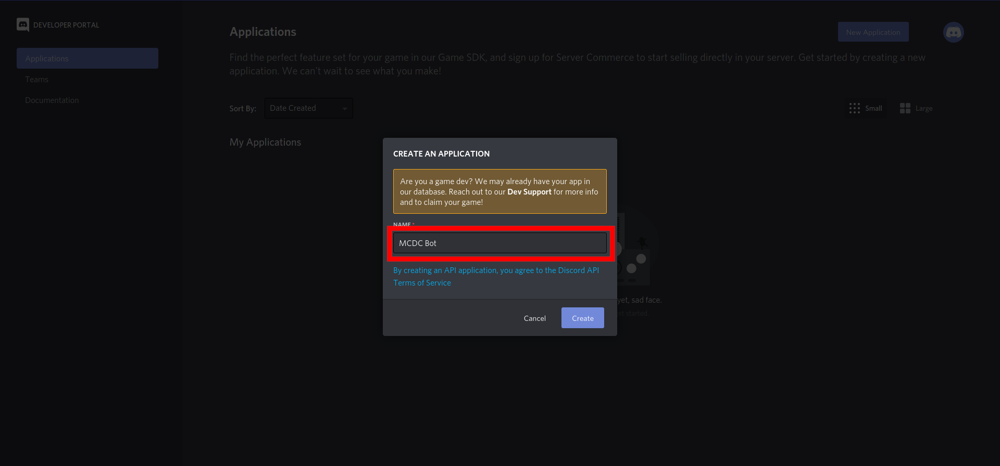
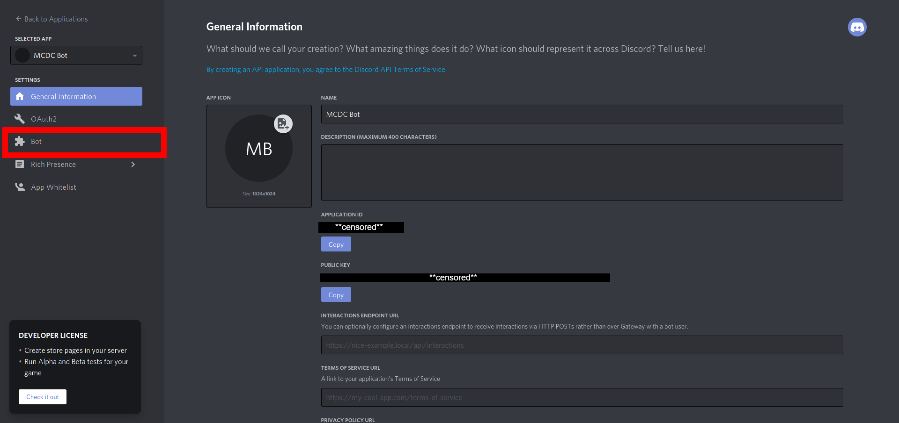
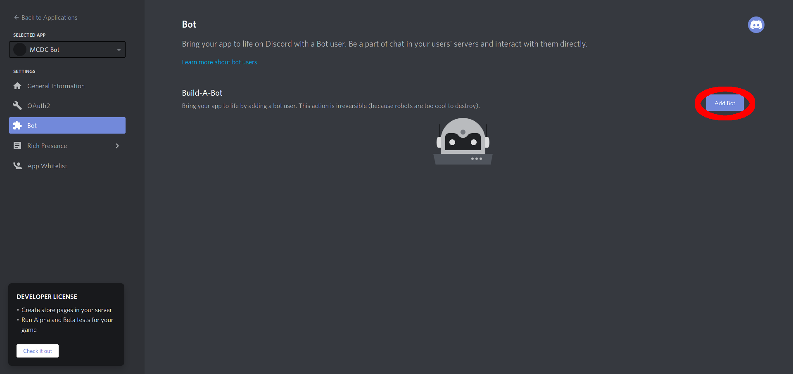
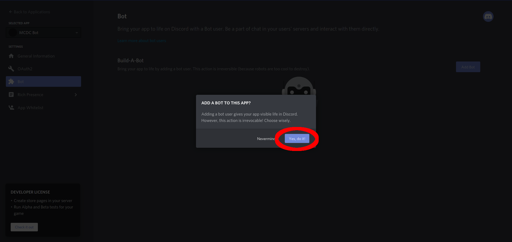
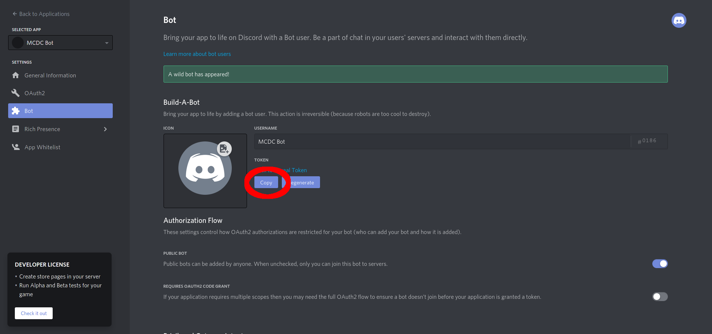
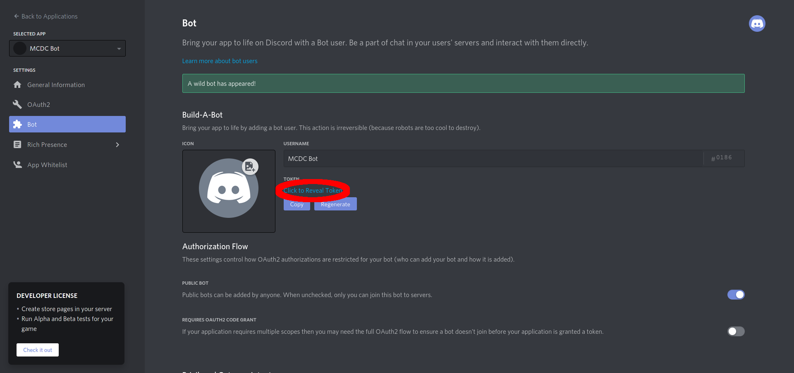
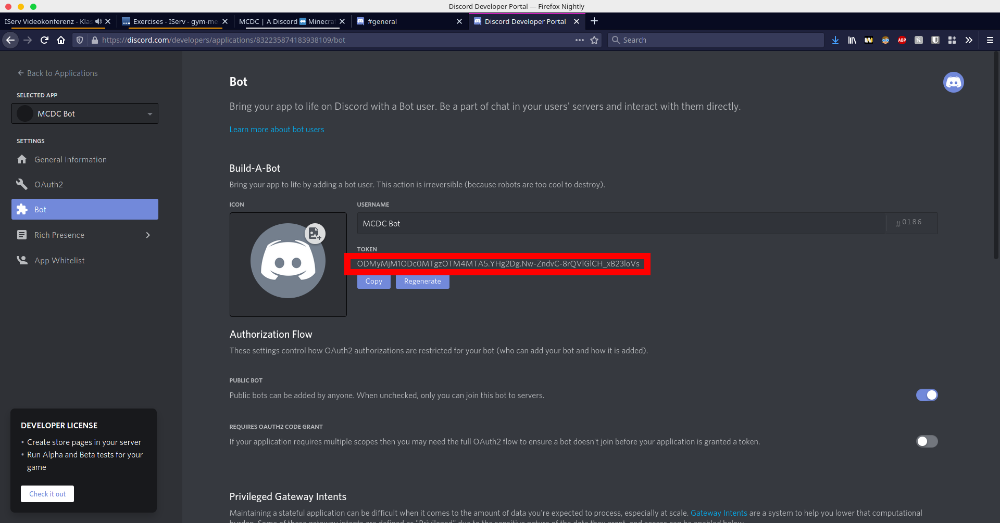

# Installation

## Get a discord bot token
1. Go to [https://discord.com/developers/applications/](https://discord.com/developers/applications).
2. In the top right corner, click on `New Application`.

3. Give the bot a name and click on `Create`.
 
4. In the left side bar, click on `Bot`.

5. In the top right corner, click on `Add bot`.

6. Confirm your actions with `Yes, do it!`.

7. Now Copy your Discord Bot Token by either clicking on `copy`:

or clicking on `Click to Reveal Token` and then mark your Token and copy it.
 
