# Installation
## Quick Installation
1. Setup a paper server. The latest JAr can be gotton from [here](https://papwemc.io/downloads).
2. Download the latest [release](https://github.com/MaFeLP/MCDC/releases/) and put it into `<your server directory>/plugins`.
3. Restart the server.
5. Get your discord bot token.
4. Go into the `<serverDirectory>/plugins/MCDC/config.yml` file and change the value of `apiToken` to your token.
4. OR Go into the console of your server and type `token <your discord bot token>` <br>


## Detailed installation
## Server installation
1. Open this link in your Browser: [https://papermc.io/downloads](https://papermc.io/downloads).
2. Click on the download button for the latest build. In this case, it is build 599.
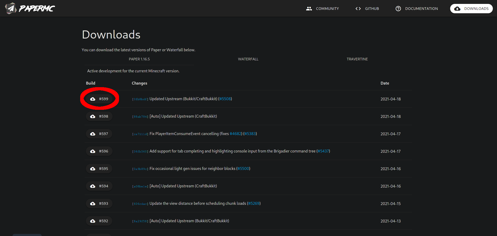
3. On Chrome and Chrome based browsers, like Microsoft Edge, wait until the circle in the bottom left corner has filled.

3. On Firefox, wait until a dialogue turns up. Then make sure, that `Save File` is selected and hit the `OK` Button. Then wait until the arrow in the status bar turn blue.
 
4. Create a new folder on your desktop. For this tutorial, we'll call it `MCDC Server`.
5. Move the downloaded jar-File into this folder.
6. Start the Minecraft server for the first time. You will see an output, similar to this one:
```
Downloading vanilla jar...
Patching vanilla jar...
System Info: Java 15 (OpenJDK 64-Bit Server VM 15.0.2+7) Host: Linux 5.11.14-arch1-1 (amd64)
Loading libraries, please wait...
[00:00:00 ERROR]: Failed to load properties from file: server.properties
[00:00:00 WARN]: Failed to load eula.txt
[00:00:00 INFO]: You need to agree to the EULA in order to run the server. Go to eula.txt for more info.
```
7. Open up the file called `eula` or `eula.txt`.
8. Copy and paste the link, starting with `https://` and ending before the brackets into your web browser. At the time of writing this website, the link is the following: [https://account.mojang.com/documents/minecraft\_eula](https://account.mojang.com/documents/minecraft_eula)
9. Read the document the link points to **carefully**.
10. If you accept Minecraft's Terms of service, change the value in the file from `eula=false` to `eula=true`. If you don't accept these Terms, you have to quit using MCDC.
11. Save the text file and quit your editor.
12. In your command line, press the up arrow once, so the last typed command appears. Hit enter to start the server.

Your server should now start up!


### Get the files
1. Go to this page [https://github.com/MaFeLP/MCDC/releases/latest](https://github.com/MaFeLP/MCDC/releases/latest) and scroll down,until you see a text called `assets`.<br>
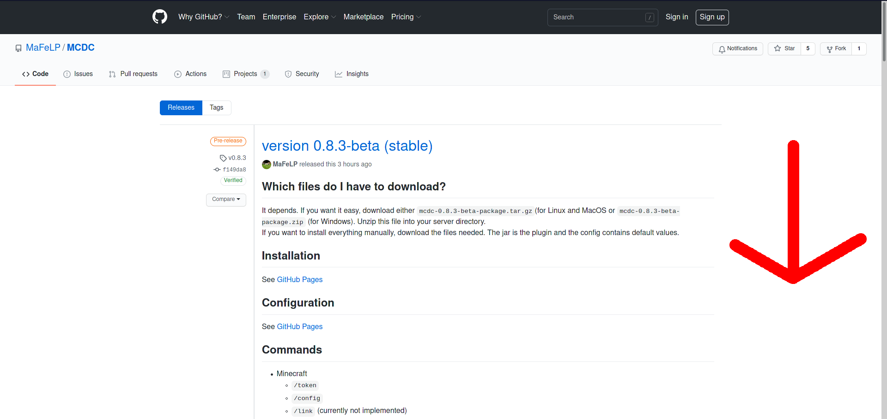
2. If not done so, expand the Assets tab by clicking on it..<br>
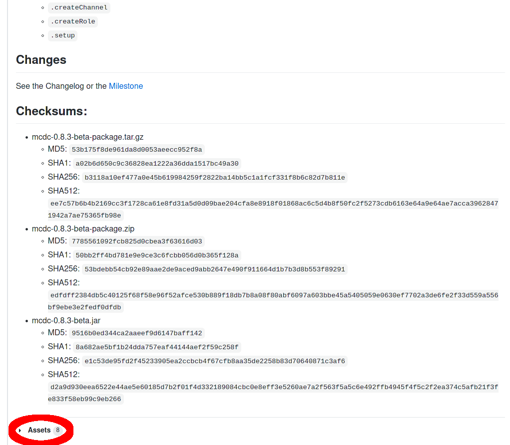
3. Download either the `mcdc-0.8.3-beta-package.tar.gz` or the `mcdc-0.8.3-beta-package.zip` file, by clicking on it. Use the `mcdc-0.8.3-beta-package.tar.gz` file, if your server runs Linux/MacOS, and `mcdc-0.8.3-beta-package.zip` if your server runs Windows.<br>
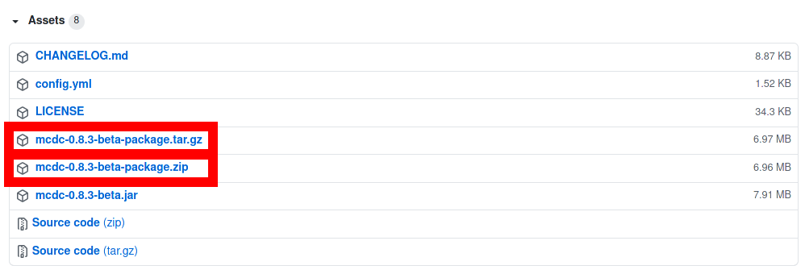

### Unpack the contents of the archive.
#### On Windows:
1. Go to `"C:\Users\YOUR USERNAME\Downloads"`.
2. Double click on the ZIP-File.<br>
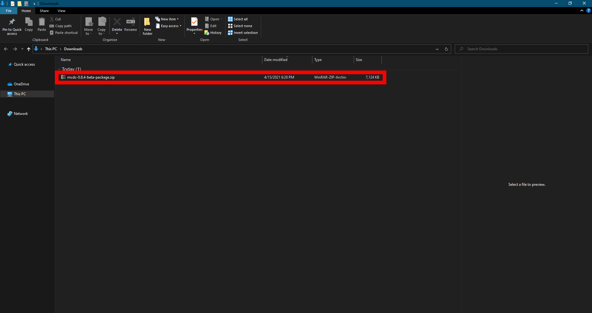
3. In the toolbar, click on `Compressed Folder Tools`.<br>
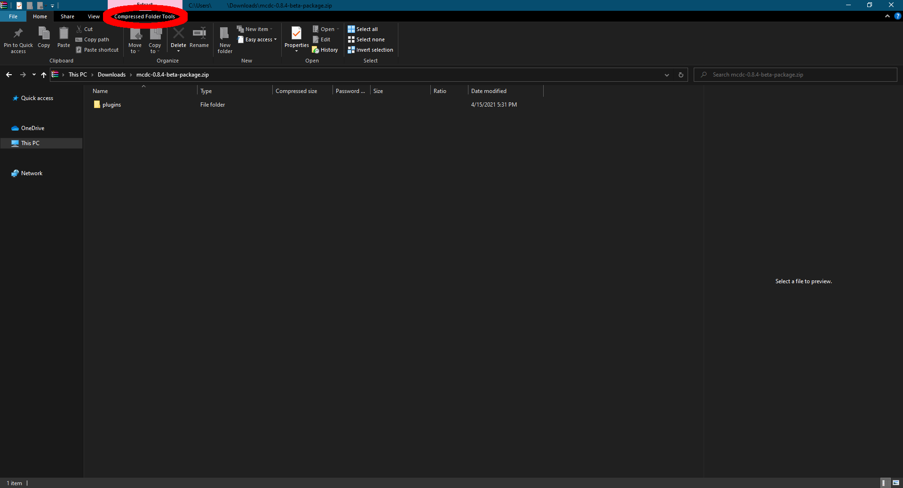
4. There, click on `Extract All`.<br>
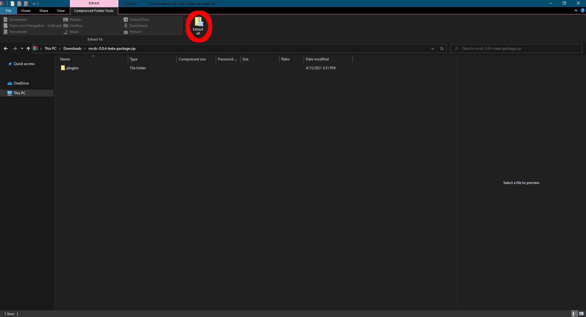
5. Choose the location, where your Server is. If your followed this Guide, it should be located in `"C:\Users\YOUR USERNAME\Desktop\MCDC Server"` and click on OK.<br>
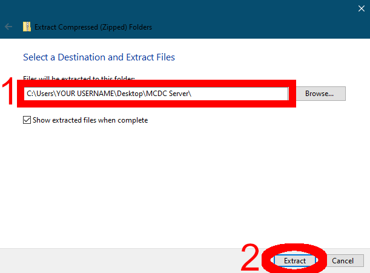
6. Then open a command prompt, by Pressing and holding the `windows key` and then pressing the `R` key.<br>
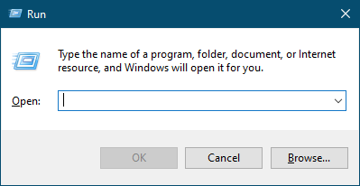
7. Then release all the keys and type `cmd`.<br>
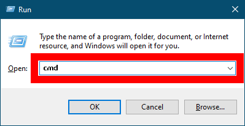
8. Click the ok button.<br>
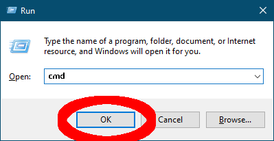

#### On MacOS:
1. Press and hold the `command key` on your keyboard. Then press and release the `space bar`. Your can not release the command key. The Spotlight-Search should now be opened.
2. Type `Terminal` and press `enter`.
3. Enter the following command into your terminal. If you installed the server somewhere else, replace `"${HOME}/Desktop/MCDC Server"` with the Path to your server's main directory.

```bash
tar -xf "${HOME}/Downloads/mcdc-0.8.3-beta-package.tar.gz" --directory "${HOME}/Desktop/MCDC Server"
```

#### On Linux:
1. Press and hold the `Ctrl` and `Alt` Keys. 
2. Press and release the `T` key. After that, release all the keys. A new Terminal windows should now be opened.
3. Enter the following command into your terminal. If you installed the server somewhere else, replace `"${HOME}/Desktop/MCDC Server"` with the Path to your server's main directory.

```bash
tar -xf "${HOME}/Downloads/mcdc-0.8.3-beta-package.tar.gz" --directory "${HOME}/Desktop/MCDC Server"
```

## Running the server
Type the following commands into your shell/command prompt (replace `server.jar` with the name of the server jar file you downloaded. e. g. `paper-582.jar`).

```bash
cd
cd Desktop
cd "MCDC Server"
java -jar server.jar nogui
```


## Get a discord bot token
1. Go to [https://discord.com/developers/applications/](https://discord.com/developers/applications).
2. In the top right corner, click on `New Application`.
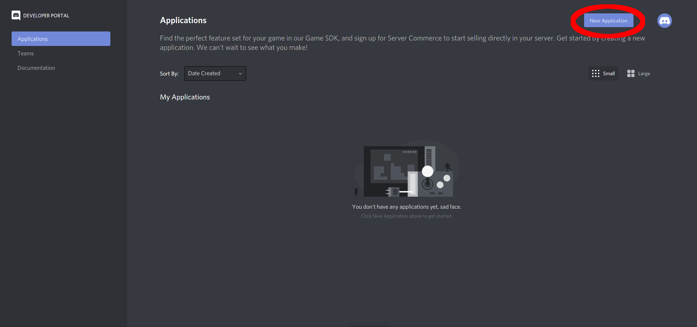
3. Give the bot a name and click on `Create`.
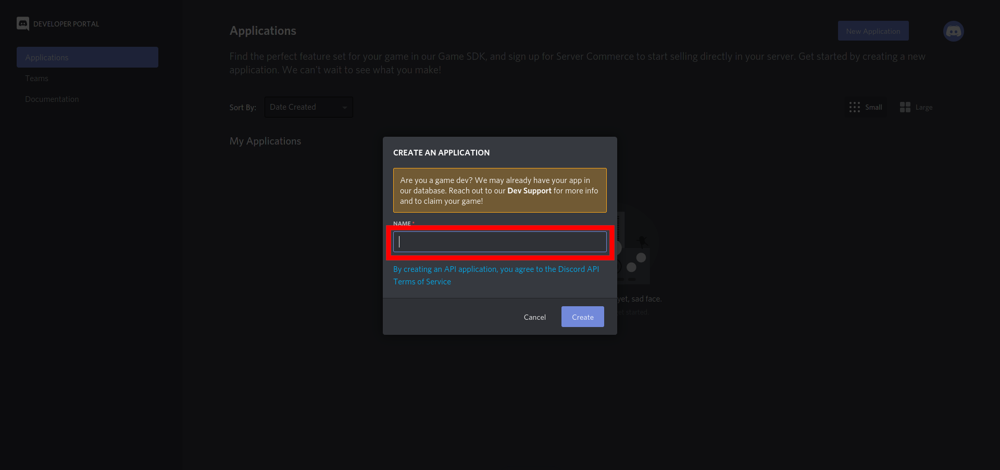 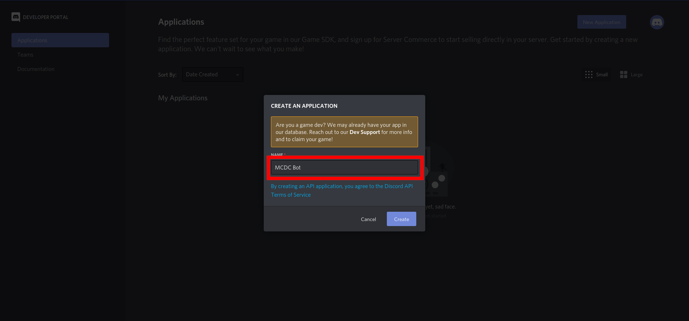
4. In the left side bar, click on `Bot`.
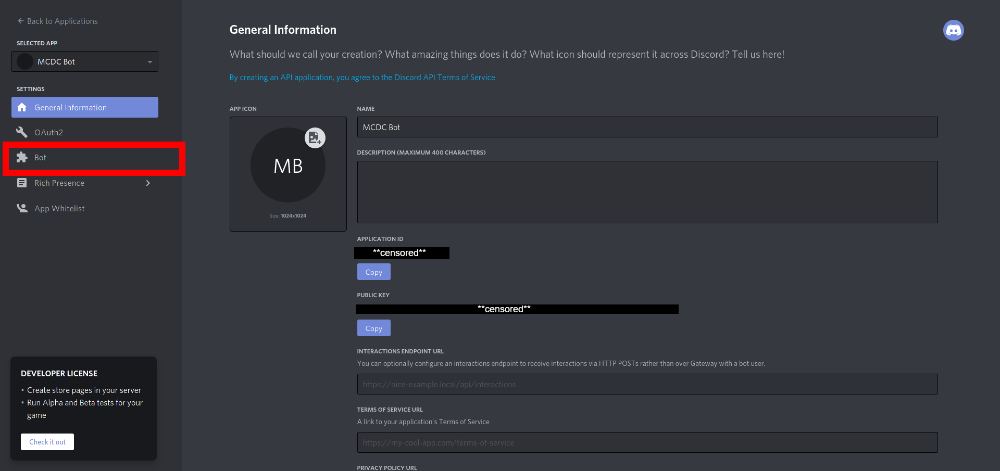
5. In the top right corner, click on `Add bot`.
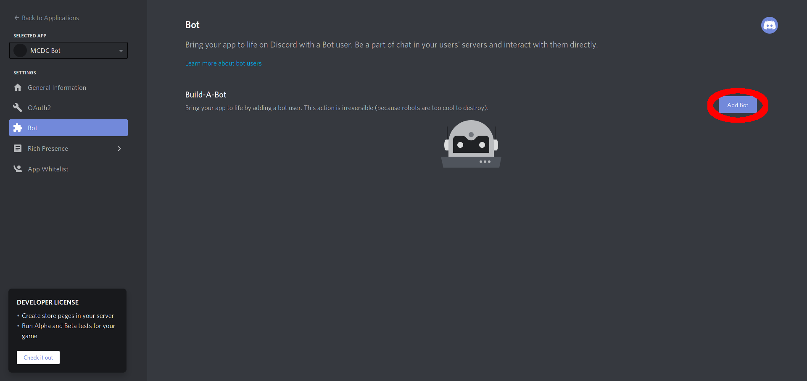
6. Confirm your actions with `Yes, do it!`.
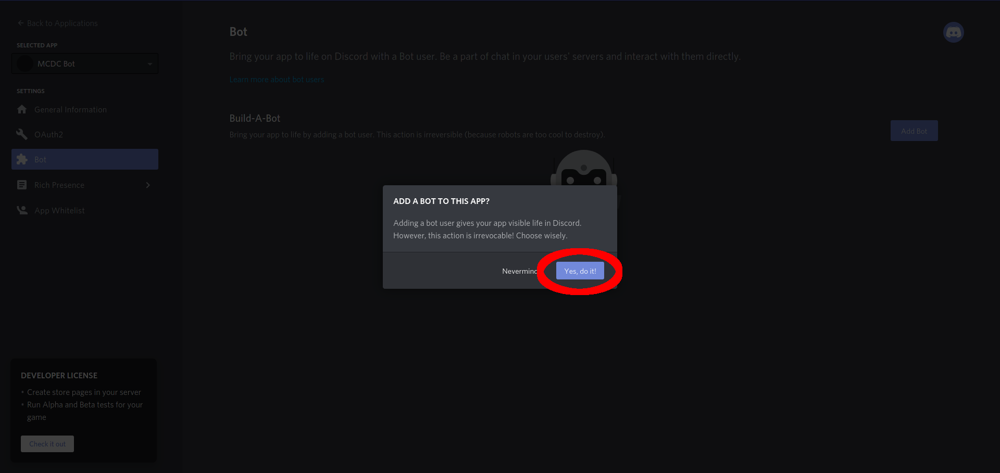
7. Now Copy your Discord Bot Token by either clicking on `copy`:
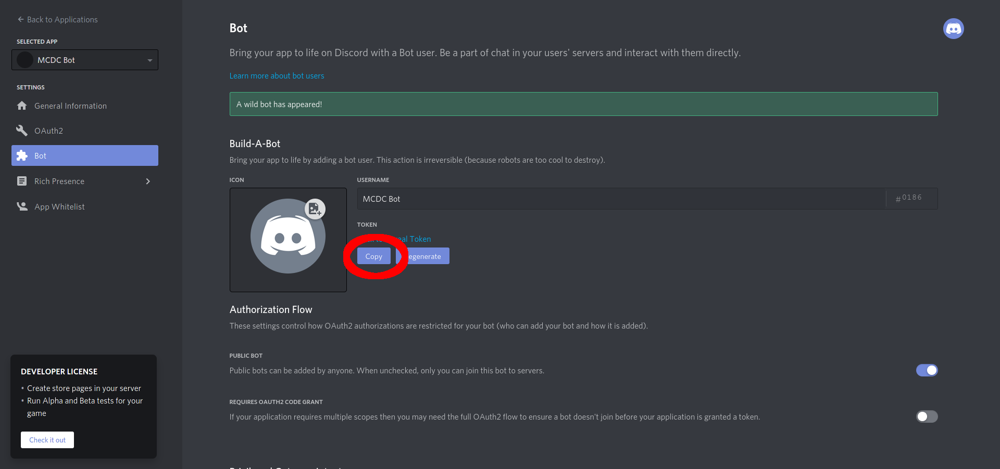
or clicking on `Click to Reveal Token` and then mark your Token and copy it.
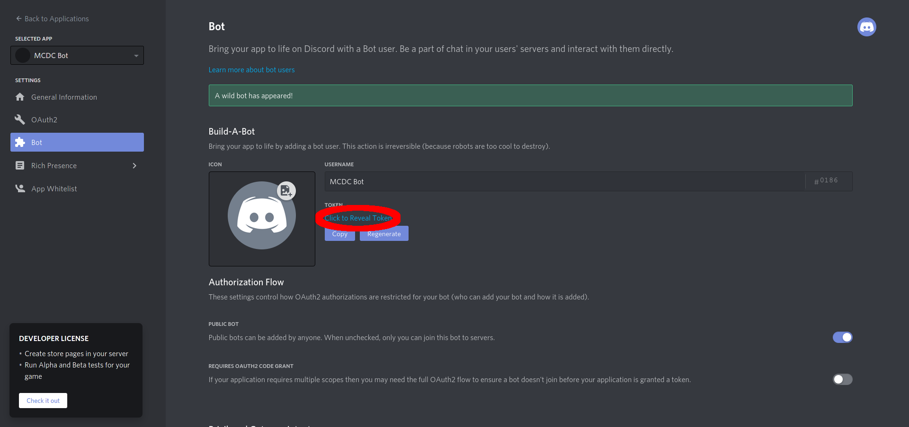 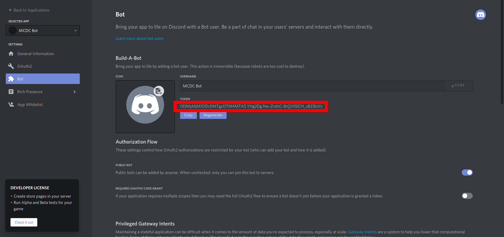
