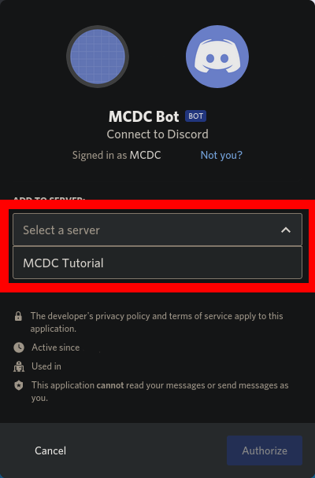
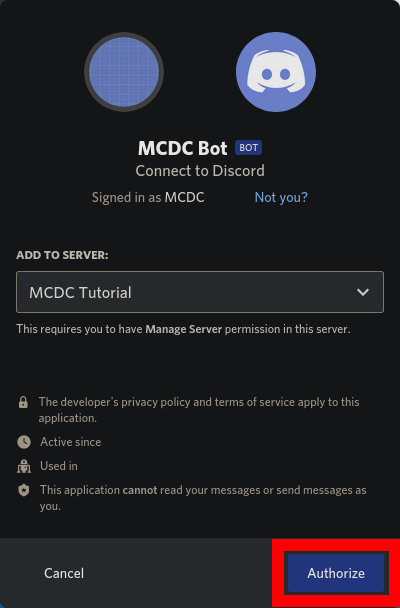
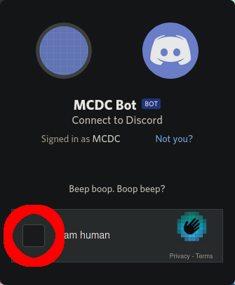
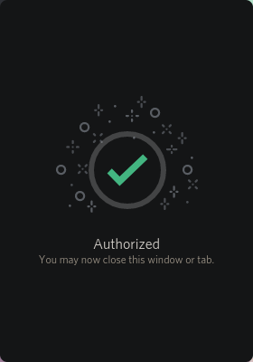
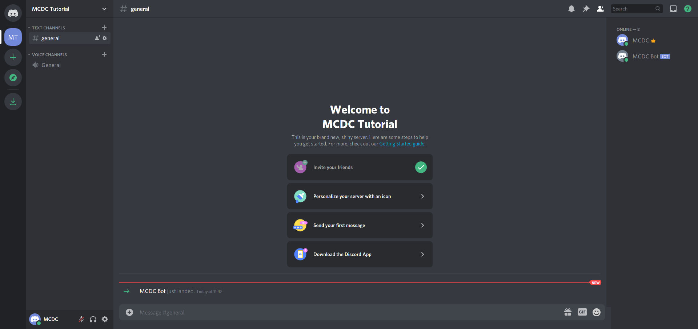

# Invite the bot
1. Copy and paste `The bot invitation token` from the console into your webbrowser and go to this website. The link should start with `https://discord.com/oauth2/authorize?client_id=`.
2. Click on the Pop-Out-Menu `Select a Server`

3. From the list, selct the Server you want to invite the bot to. If the specific server does not appear there, make sure you have the required permissions to invite and manage bots to the server.

4. After you selcted the server, click on `Authorize`.

5. Solve the Captcha by clicking the square left to `I am human` and selecting the fitting images by clicking on them (not everyone has to solve these captchas! Don't be worried, if you don't have to solve them.)

6. You should now see a green tick that says `Authorized`.

7. Your bot should now appear on your server:

